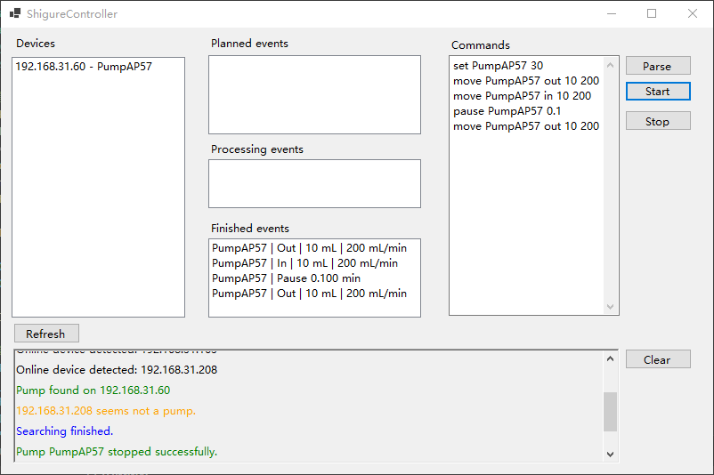

# SHIGURE：一款开源的在线控制注射泵

## 背景和原理

输液泵是实验室自动化中最基础的部件之一，而注射泵是所有泵中最容易DIY的（虽然成本不一定最低）。市场上注射泵的价格在500~1000+ RMB左右，相比之下DIY的注射泵更有性价比，不仅能实现相似的功能，还有灵活得多的控制方式，可适配多种自定义的用途。SHIGURE是开源的在线控制注射泵，遵循如下步骤，每个人都能组装出一台可以同时使用Wifi和串口方式控制的注射泵，并且借助客户端可以实现复杂的流程控制、甚至多泵协同工作。

## 目录结构

Models： 3D打印PCB外壳文件；各固定件的图纸文件；

PCB：嘉立创EDA的项目文件和Gerber文件；

ShigureController：控制软件代码；

shigure_main.py：树莓派pico上的micropython代码。

## 精度参数

| 注射器（mL) | 最小流速 （mL/min) | 最大流速 （mL/min) | 流速精度 |
| ------- | ------------- | ------------- | ---- |
| 30      | 0.51          | 200           | ±5%  |
| 10      | 0.20          | 80            | ±3%  |
| 5       | 0.15          | 50            | ±1%  |
| 1       | 0.03          | 10            | ±1%  |

## 物料和成本

以下为直接采购的物料：

| 物料            | 数量  | 型号/供应商                    | 单个成本 (RMB) |
| ------------- | --- | ------------------------- | ---------- |
| 丝杆滑台          | 1   | 1204/100 mm 东台市欧力传动部件有限公司 | 150        |
| 限位开关          | 2   | NPN 海杰嘉创行星减速机工厂           | 15         |
| 树莓派Pico W     | 1   | -                         | 52         |
| TMC2209模块     | 1   | 同拓展志                      | 14         |
| M4螺丝          | 4   | -                         | -          |
| M4螺柱          | 4   | -                         | -          |
| 手拧螺母（羊角）      | 4   | -                         | -          |
| 手拧螺母（圆形）      | 4   | -                         | -          |
| 1 k电阻         | 5   | -                         | -          |
| 二极管           | 2   | IN4148                    | -          |
| LED           | 2   | -                         | -          |
| CH340串口转USB模块 | 1   | -                         | 6          |
| 导线、连接座        | 若干  | -                         | -          |

以上各部件均来自淘宝。树莓派Pico W必须使用原版。

需要制作4个固定件，参考成本：嘉立创3D打印，约25元；嘉立创钣金加工，约70元。

## 机械部分装配过程

1. 打印零件
   
   固定件1
   
   
   
   固定件2（互为镜像的一对，以下只展示一个）
   
   
   
   固定件3
   
   
   
   固定件4
   
   
   
   关于孔大小：
   
   * 所有孔均设计为M4尺寸。在图纸中，孔直径按照3.3 mm画，如果进行CNC加工可以自动识别为M4螺丝座。如果是3D打印，需将孔直径改成合适的值（至少是4 mm）。
     
     其中固定件4要特别说明。固定件4上的2个螺纹孔位需要插入M4螺柱，且上下没有螺母紧固，需要自身螺纹将螺柱咬住。这是所有打印件里唯一对孔大小有较严格要求的部分。如果使用3D打印加工，图纸上的孔位半径需要根据打印机状态调整，适应公差。例如，开发者自有的3D打印机打出来的孔负公差很大，而嘉立创的3D打印则公差较小。对于前者，此处孔径需要设计为4.4 mm左右，而对于后者可设计为3.8 mm左右，需要尝试和经验。好在对于树脂3D打印器件，无论孔是开得偏大还是偏小都有手动处理的办法，如果孔太大可以用热熔胶将螺柱粘上去，如果孔太小可以用火烧一烧。
     
     

2. 安装限位开关
   
   

3. 安装固定件1，将螺丝打在电机一侧固定端的孔位，在外侧以螺母固定，并利用两侧的孔位安装弹簧。图纸中设计了2个弹簧孔位，至少要在顶部与注射器卡槽平齐的一组安装弹簧。
   
   

4. 在丝杆滑台侧面安装固定件2，将螺丝打进滑块侧面的孔位，在外侧以螺母固定。
   
   

5. 通过固定件2，插入M4螺柱，在靠内侧一端以螺母固定，靠外侧一端放入圆形手拧螺母。随后在螺柱上安装固定件4，外侧以羊角手拧螺母固定。这里螺柱的作用是调节注射器活塞卡口位置以适配各种型号、或存有各种体积液体的注射器，因此可以选用足够长的螺柱。作为演示，此处使用了短螺柱。
   
   

6. 在固定件4的两个空位上插入M4螺柱，不使用螺母固定。在螺柱上依次放入圆形手拧螺母、固定件3、羊角手拧螺母。放入注射器，通过调节4组手拧螺母可改变固定件3和4的位置以适应注射器长度和高度。
   
   
   
   以下是使用钣金件的版本，强度更高：
   
   
   
   ## 电子部分
   
   使用树莓派Pico W进行控制，利用TMC2209驱动电机。以下为原理图：
   
   
   
   TMC2209模块采用Pico的5 V供电，57步进电机使用12 V/2 A的电源。电机电源线和4个线圈连线接在TMC2209上。Pico的GPIO0和1分别用作DIR和PUL，GPIO2~4分别用于控制电源指示灯、控制WIFI指示灯和接收开关按键信号。GPIO12和13留作与上位机通信的串口接口。
   
   两个限位开关使用5 V供电，两个限位开关平时输出5 V电压，在滑块靠近时输出0 V。由于Pico不能直接读取5 V电平，使用二极管钳位电路将限位开关输出的5 V转化为大约0.7 V电位后，通过GPIO26和27进行ADC读取。当这两个引脚的输入电压低于0.5 V时，判定为滑块接近限位开关，停止滑块运动。
   
   在面包板上的连接相对而言是比较简单的：
   
   
   
   以上电路可以转移到一个7.2 * 7.0 cm2的PCB板上：
   
   

## 操作过程

### AP模式

SHIGURE第一次运行时，Wifi处于未配置状态。开始运行后，GP2连接的电源LED亮起，GP3连接的Wifi LED不亮，程序处于AP模式，将产生一个以PumpXX为名称的Wifi信号，其中XX是100以内的随机数。连接这个Wifi（密码是bsjinstrument）后，访问192.168.4.1，进入注射泵控制页面。


在这一页面，可以输入Wifi信息，点击Configure，则机器将Wifi信息写入存储中并自动重启连接该Wifi，进入Wifi模式，此时GP4连接的Wifi LED亮起。Pump name可以自定义。机器连接Wifi后，AP模式同样可以使用，与此同时，同Wifi内的设备也可以访问注射泵。

如果需要重置，可以长按开关3 s。如果短按，则设备会重启但不重置。

### 网页控制

在网页内的Motion模块，可以选择注射器型号、设置体积和流速。In和Out分别对应吸液和推液。点击Reset后，SHIGURE会推出液体，直到达到限位开关位置。

如果注射器规格选择0 mL，则Volume和Speed分别表示移动的距离（mm）和速度（mm/min)。

### 客户端控制

Wifi模式中，注射泵连接Wifi并获得IP地址。输入注射泵的IP地址后，可以打开相同页面。但一般用户不容易知道注射泵的IP地址，ShigureController客户端提供了控制局域网内所有注射泵的平台。


运行ShigureController后，程序会自动搜索局域网内的设备，将注射泵的IP和名称列出。用户在Commands里，按照如下格式输入命令：

```
set ID xx #为相应ID的泵设置注射器规格为xx mL
move ID direction volume speed
    #让相应ID的泵按照给定方向（in或out）以指定流速（mL/min）运行指定体积（mL）
pause ID xx #让相应ID的泵停止xx min
```

以下是一个例子：

```
set PumpAP57 30
move PumpAP57 out 10 200
move PumpAP57 in 10 200
pause PumpAP57 0.1
move PumpAP57 out 10 200
```

在这个例子中，PumpAP57采用30 mL注射器，先以200 mL/min打出10 mL，再吸入10 mL，暂停6 s后再打出10 mL。为了兼容网络延迟，使用客户端控制时，每两个动作之间会有一段3 s的暂停。

当存在多个泵时，可以用类似的方法控制每个泵实现协同工作。（但目前未测试过多泵协同，这是由于只组装了一台）

在输入命令后，首先点击Parse，则这些事件规划进入到Planned events中：


然后点击Start，开始依次执行：


执行完成后，所有事件都将进入到Finished events中。当然也可以随时点击Stop停止流程。



### 串口控制

除了网络控制外，SHIGURE预留了串口线，可以同时接受串口信号，但不会返回信号。波特率采用9600，通信格式为： 

```
set syringe XX #设置注射器规格为XX mL
move direction volume speed 
    #按照给定方向（in或out）以指定流速（mL/min）运行指定体积（mL）
stop #停止
reset #重置
```

## 关于

SHIGURE是BSJ INSTITUTE开发的第二款开源硬件。我们将推出更多开源硬件，推动科学研究的普及化和自由化。
